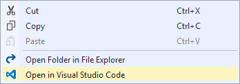
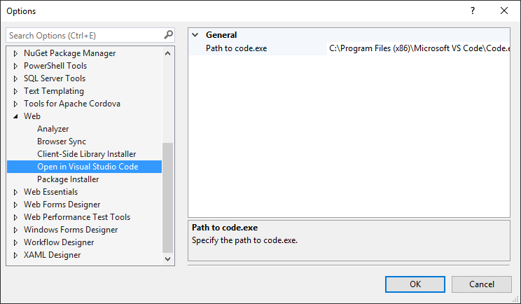

# Open in Visual Studio Code
A Visual Studio extension that adds a menu command that
lets you open any solution, project, folder or file in
Visual Studio Code.

Download the extension at the
[VS Gallery](https://visualstudiogallery.msdn.microsoft.com/33f6f3fd-68e8-4783-b934-ece91a08d265)
or get the
[nightly build](http://vsixgallery.com/extension/e99dde0e-e023-410d-bc5d-3f76db71e3f0/)

------------------------------------

This extension is for those times where you have a project
open in Visual Studio and you want to be able to quickly
open it in Visual Studio Code.

## Prerequisite
In order to use this extension, you must have Visual
Studio 2015/2017/2019 as well as Visual Studio Code installed.

You can
[download Visual Studio Code](https://code.visualstudio.com/)
for free.

## Solution Explorer
You can open any solution, project, folder or file in
Visual Studio Code by simply right-clicking it in Solution
Explorer and select
**Open in Visual Studio Code**.

## Open current file
You can also open the current file in Visual Studio Code 
by clicking onto **Extensions->Open in Visual Studio Code**.

The default key binding is `Ctrl+Shift+Y`.

## Path to Code.exe
If you installed Visual Studio Code at a non-default location,
a prompt will ask for the path to _Code.exe_.

You can always change the location in
**Tools -> Options -> Web -> Open In Visual Studio Code**.

## License
[Apache 2.0](LICENSE)
